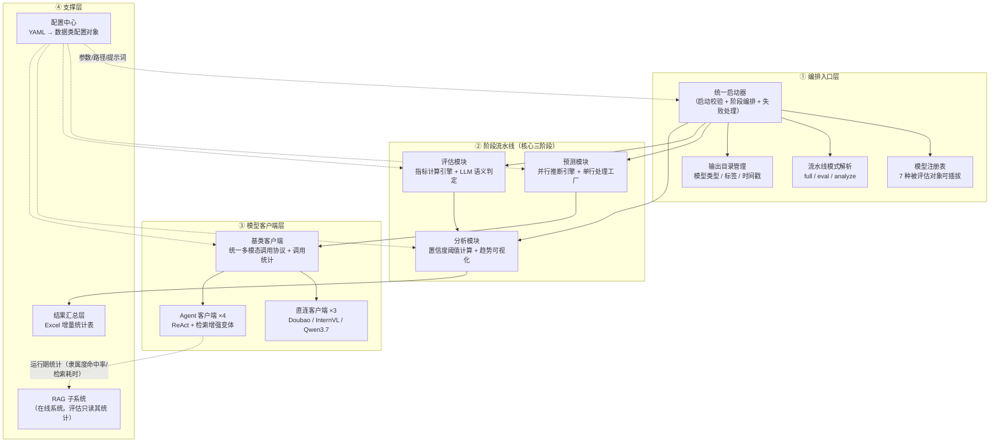
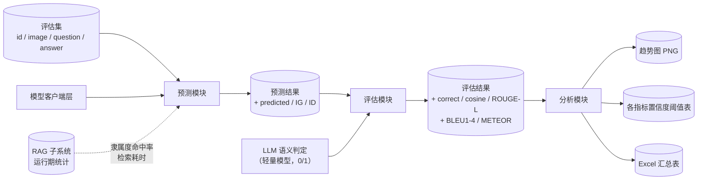
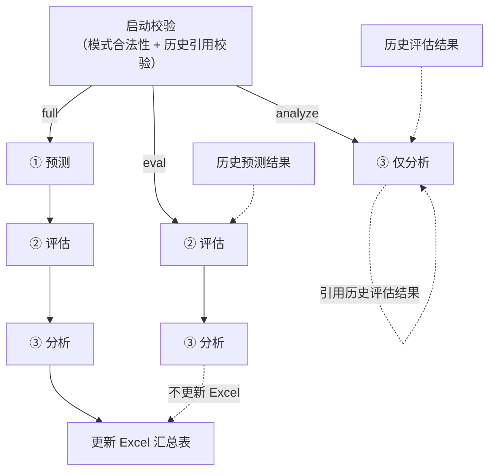
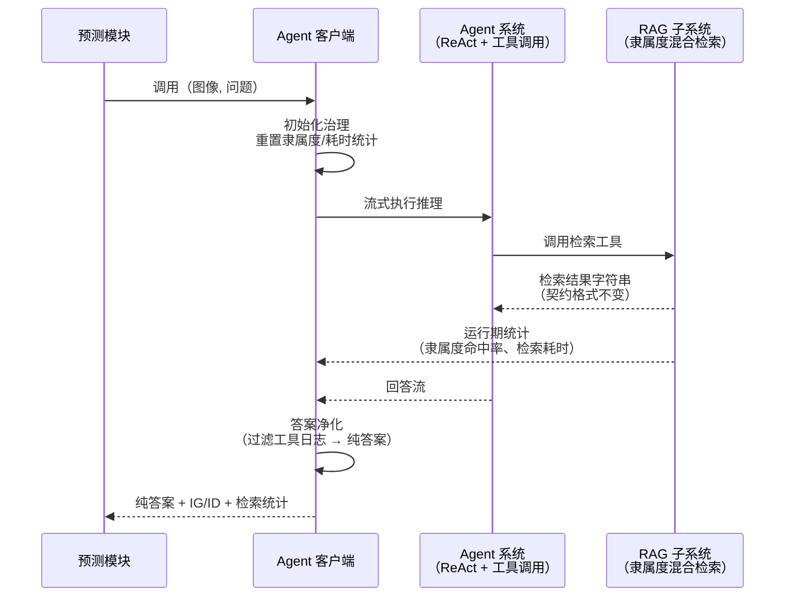

# SAR-VQA 评估流水线架构设计

> 本文描述由评估统一入口启动的**离线评估流水线**的总体架构——从"选择模型 → 大规模预测 → 多维打分 → 统计分析 → 汇总存档"的完整链路，以及它与在线 RAG 问答系统的集成关系。
> 架构描述以功能模块为单位，不涉及具体代码文件。

---

## 1. 总体分层架构

### 各层职责

| 层 | 模块 | 职责 |
|---|---|---|
| ① 编排入口层 | 统一启动器 | 接收"评估哪个模型 + 跑哪几步"，校验配置合法性，按模式编排三阶段，任一步失败记录状态并终止 |
| | 模型注册表 | 模型键 → 客户端/模型类型/文件标签/是否 Agent 的映射，一处切换被评估对象 |
| | 流水线模式解析 | full（全流程）/ eval（跳过预测）/ analyze（仅分析），校验历史引用是否存在 |
| | 输出目录管理 | 每次运行生成唯一时间戳目录，三阶段产物统一归档，不污染历史结果 |
| ② 阶段流水线 | 预测模块 | 读取评估集 → 线程池并发调用模型 → 批量落盘 → 产出预测结果（含 IG/ID） |
| | 评估模块 | 逐行计算词面/词重叠/语义三类指标，LLM 判定正确性，产出评估结果表 |
| | 分析模块 | 每个指标计算"达到目标置信度的最小阈值"，绘制取值-置信度趋势曲线 |
| ③ 模型客户端层 | 基类客户端 | 统一图像编码、提示词构造、消息组装与调用统计协议 |
| | 直连客户端 | 裸多模态模型的薄封装（无检索增强） |
| | Agent 客户端 | 把完整 ReAct Agent（含三阶段混合检索）作为被评估对象，含初始化治理/统计回收/答案净化/命名空间隔离 |
| ④ 支撑层 | 配置中心 | 全系统参数唯一来源：模型端点、数据集路径、并发数、置信度、指标清单、提示词模板 |
| | 结果汇总层 | 每次 full 运行追加一行：调用统计、检索统计、隶属度命中率、评估指标均值、置信度样本数 |
| | RAG 子系统 | 在线问答系统，评估流水线不直接调用其检索逻辑，只读取其运行期统计 |

---

## 2. 数据流与产物链路

### 产物说明

- **中间产物**：预测结果与评估结果均同时输出"带时间戳归档版"与"最新版"，供下游阶段与 `eval`/`analyze` 模式引用
- **最终产物**：各指标趋势图、置信度阈值表、Excel 跨运行汇总
- **信息指标**：IG（信息增益度）与 ID（信息密度）基于遥感领域词汇表计算，Agent 变体优先采用其真实 RAG 输出计算

---

## 3. 流水线三种运行模式

| 模式 | 执行步骤 | 引用 | Excel |
|---|---|---|---|
| full | 预测 → 评估 → 分析 | 无 | 更新 |
| eval | 评估 → 分析 | 历史预测结果（按时间戳定位） | 跳过 |
| analyze | 仅分析 | 历史评估结果（按时间戳定位） | 跳过 |

---

## 4. 模型客户端层与 RAG 子系统的集成

### 集成要点

- **边界清晰**：评估系统不直接触碰检索逻辑，通过 Agent 客户端把"完整检索增强 Agent"整体作为被评估对象加载
- **统计回读**：评估结束后回读 RAG 子系统的类级统计（隶属度命中率）与中间件耗时统计（检索调用次数/平均耗时），作为评估指标写入汇总表
- **命名空间隔离**：加载 Agent 系统前临时移除评估系统自身的路径与模块缓存，规避两套同名工具/配置包冲突，导入完成后恢复
- **答案净化**：从流式回答中剔除检索结果文本与工具调用日志，截取纯回答（限 200 词）作为预测答案参与打分

---

## 5. 关键设计特性

| 特性 | 设计 |
|---|---|
| 可断点续跑 | 三阶段独立，eval/analyze 模式按时间戳引用历史产物 |
| 高并发 | 预测与评估均为线程池并行（并发数独立可配），线程锁保护统计与输出 |
| 失败韧性 | 单行失败记数不中断；阶段失败终止流程但状态如实入表 |
| 被评估对象可插拔 | 注册表一处切换：裸模型 vs 完整 Agent，用于对比"检索增强"的增益 |
| 双系统隔离 | 评估系统与在线问答系统共享配置/模型工厂，但运行期互不干扰 |

---

*更新时间：2026-08-06*
