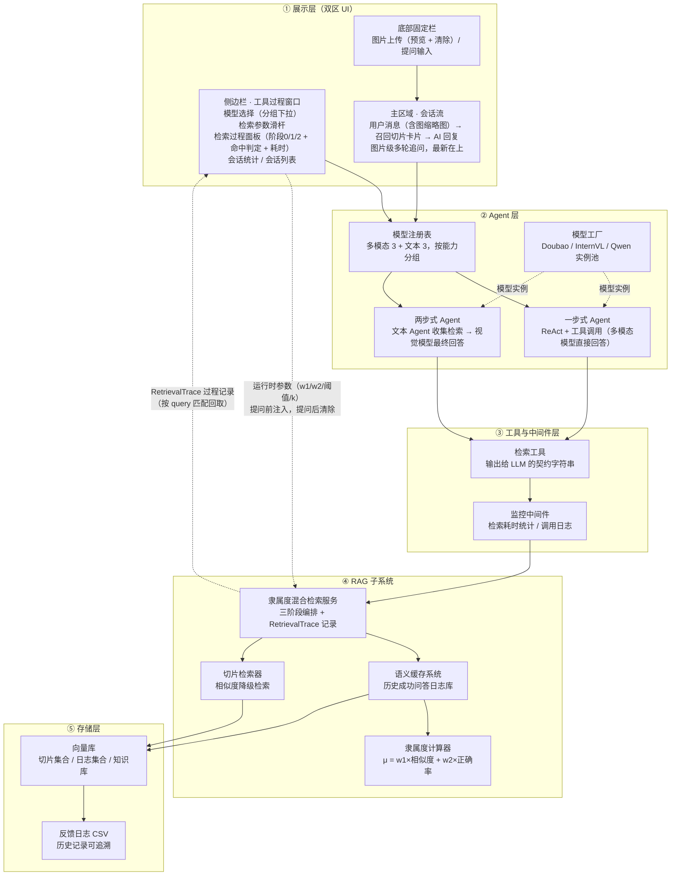
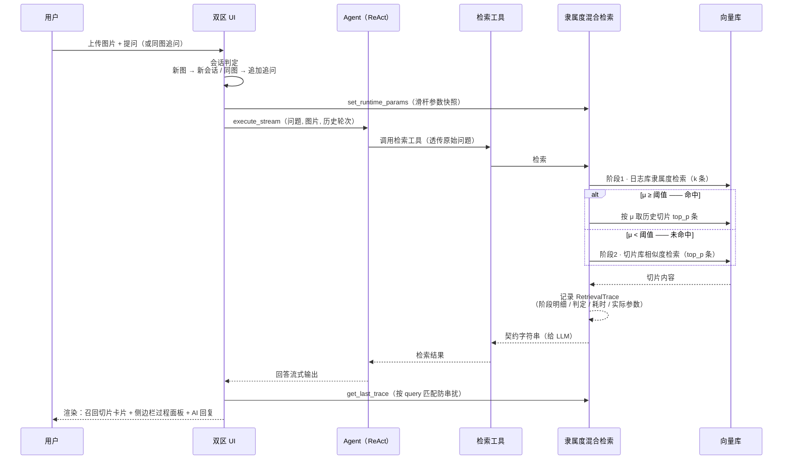
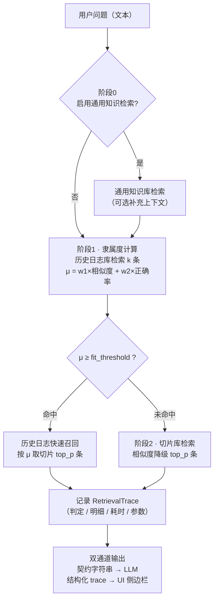
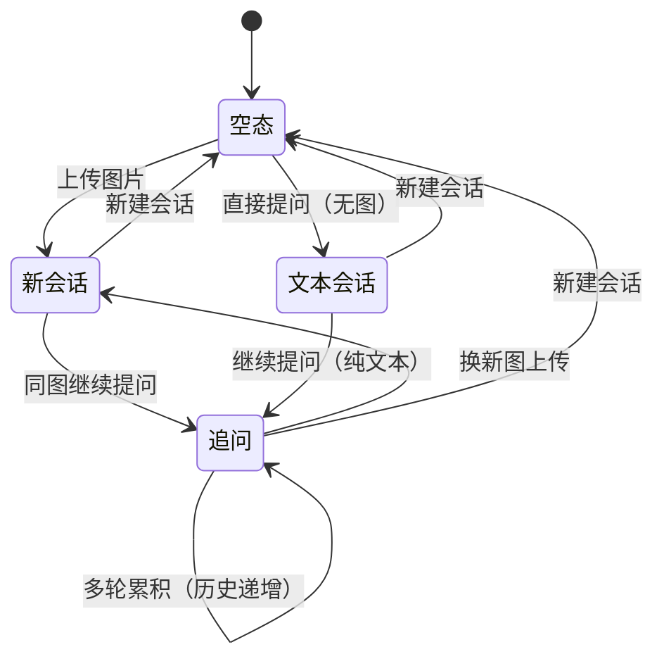
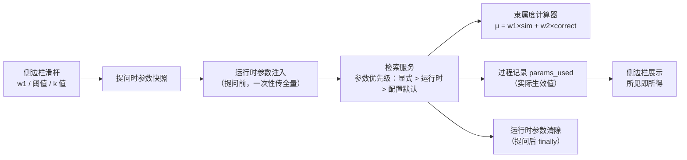
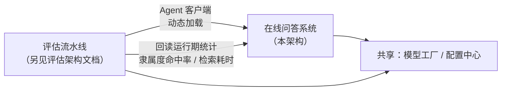

# 在线遥感问答系统架构设计

> 本文描述**在线交互问答系统**的总体架构——从"上传图片 + 提问"到"检索过程可视化 + 切片召回 + AI 回复"的完整链路，包括隶属度混合检索的三阶段决策、运行时参数配置机制与多轮会话管理。
> 架构描述以功能模块为单位，不涉及具体代码文件。

---

## 1. 总体分层架构

### 各层职责

| 层 | 模块 | 职责 |
|---|---|---|
| ① 展示层 | 侧边栏 · 工具过程窗口 | 模型切换、检索参数滑杆（运行时生效）、检索过程可视化（阶段明细/命中判定/耗时）、会话级统计、历史会话入口 |
| | 主区域 · 会话流 | 每轮"用户消息 → 召回切片卡片 → AI 回复"；切片卡片带得分徽标（μ/sim）+ 内容展开；最新轮在上 |
| | 底部固定栏 | 图片上传暂存（on_change 回调）、预览与清除、问题输入 |
| ② Agent 层 | 模型注册表 | 模型键 → 代理类/模型实例/图像能力/分组，默认值：多模态 Doubao Seed、文本 Doubao 1.5 Lite |
| | 一步式 Agent | 多模态模型直接承担 ReAct 推理与工具调用（Doubao / 文本模型） |
| | 两步式 Agent | InternVL 变体：文本 Agent 先收集检索上下文，视觉模型再基于图像+上下文作答 |
| | 模型工厂 | 全部模型实例的唯一创建点（端点/密钥/参数封装） |
| ③ 工具与中间件层 | 检索工具 | 对 LLM 暴露的唯一检索入口，返回契约格式字符串（格式稳定不变） |
| | 监控中间件 | 包装工具调用：记录耗时（会话级+全局）、失败告警、日志 |
| ④ RAG 子系统 | 隶属度混合检索服务 | 三阶段编排（知识库 → 隶属度 → 切片降级），每次调用生成过程记录 |
| | 语义缓存系统 | 管理历史成功问答日志库（向量化 + CSV 同步） |
| | 隶属度计算器 | 新问题与历史日志算隶属度：相似度与正确率的加权和，自动归一化 |
| | 切片检索器 | 未命中时的相似度降级检索 |
| ⑤ 存储层 | 向量库 | 三类集合：问答切片、历史日志、通用知识库 |
| | 反馈日志 CSV | 日志库的落盘同步，运行期可追溯 |

---

## 2. 一次问答的完整时序

### 关键机制

- **流式**：AI 回答逐 chunk 渲染，期间状态条提示"调用检索工具"
- **Trace 匹配**：过程记录按"问题文本 == 本轮提问"取回，避免上一轮残留误显
- **多轮追问**：历史轮次只传文本，图片仅出现在最新一轮；换图即开新会话

---

## 3. 隶属度混合检索：三阶段决策流程

| 阶段 | 触发条件 | 行为 |
|---|---|---|
| 0 通用知识 | 配置开关 | 从通用知识库检索上下文，合并进工具输出 |
| 1 隶属度 | 总是执行 | 日志库相似度检索 → 加权隶属度 → 与阈值比较 |
| 2 切片降级 | 隶属度未命中 | 切片库相似度检索（归一化排序后取 top_p） |

**隶属度公式**：`μ = w1 × 语义相似度 + w2 × 历史正确率`，权重自动归一化（默认 0.9 / 0.1，滑杆可调）。

---

## 4. 会话状态机（图片级多轮）

### 会话数据模型

- **会话**：图片（可空）+ 轮次列表；以图片唯一性区分"新会话"与"追问"
- **轮次**：用户问题、图片快照、AI 回答、检索过程记录、耗时、异常标记
- **切换**：侧边栏会话列表点击回看/续聊；所有状态持久化于页面会话级存储，刷新不丢失

---

## 5. 检索参数运行时配置链路

- **不写配置文件**：滑杆调整只影响当次提问，重启回落 YAML 默认值
- **w2 联动**：w2 = 1 − w1 自动联动，保证权重和为 1
- **阈值 0 值语义**：0.0 可真正生效（不会被误判为"未设置"）

---

## 6. 与评估流水线的关系

- **共享**：两套系统共用模型工厂与配置中心，模型实例与参数口径一致
- **被评估对象**：评估流水线通过 Agent 客户端把本系统的"完整检索增强 Agent"作为被评估对象加载，评估其端到端问答能力
- **统计回读**：评估结果中的隶属度命中率、检索耗时来自本系统的运行期统计（在线问答 UI 的侧边栏统计区展示同一数据源）

---

## 关联文档

- [评估流水线架构设计](./benchmark-architecture.md)
- [mainapp 双区 UI 展示优化设计（spec）](./superpowers/specs/2026-08-05-mainapp-streamlit-trace-ui-design.md)
- [mainapp 双区 UI 实施计划（plan）](./superpowers/plans/2026-08-05-mainapp-streamlit-trace-ui.md)

---

*更新时间：2026-08-06*
